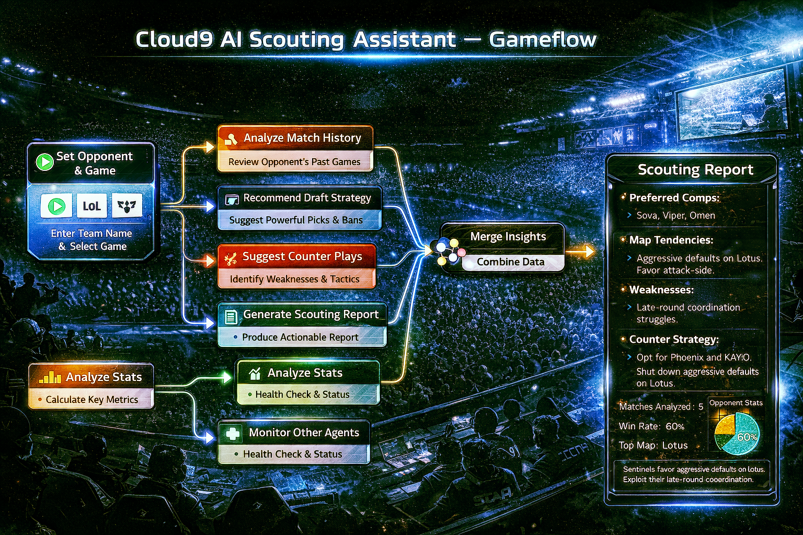
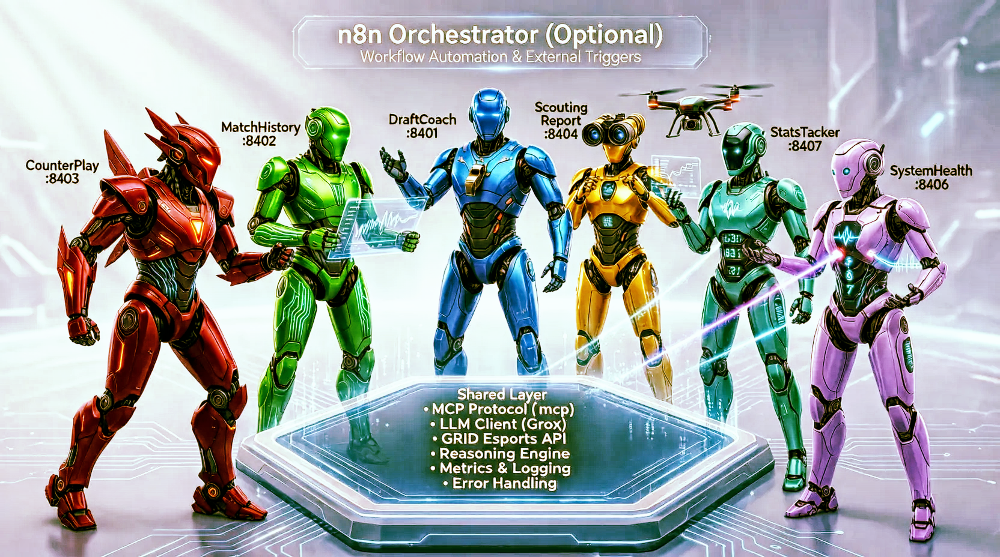
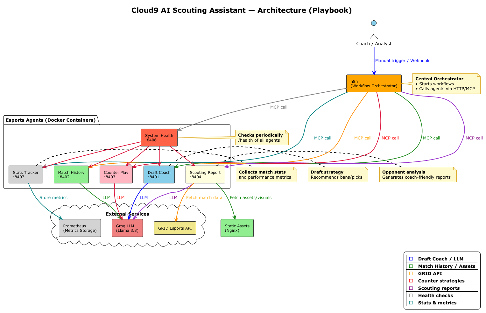
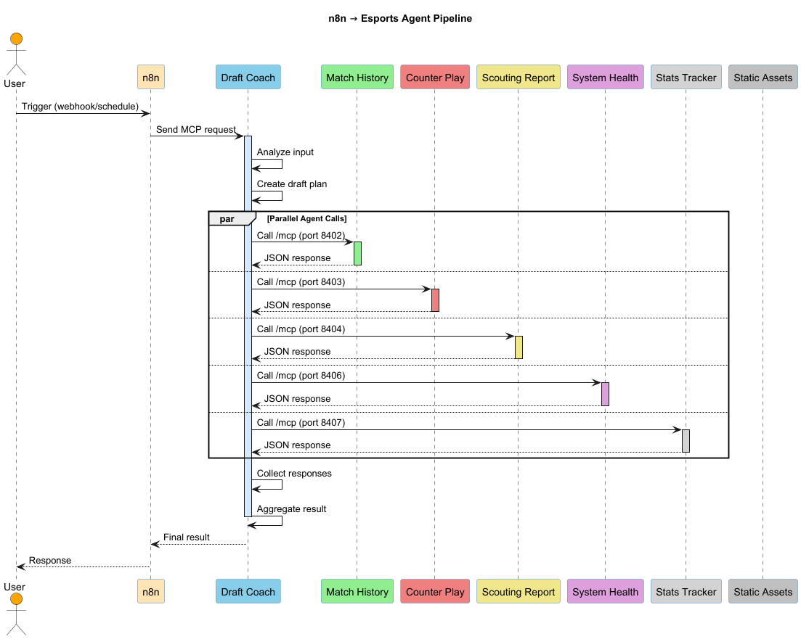
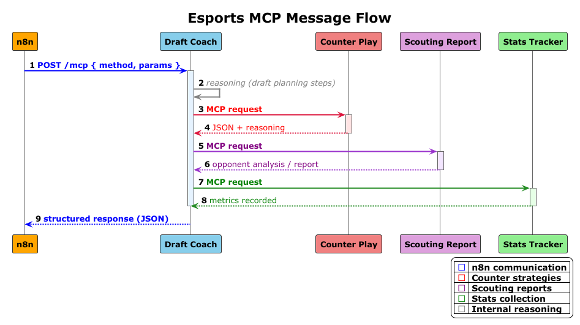
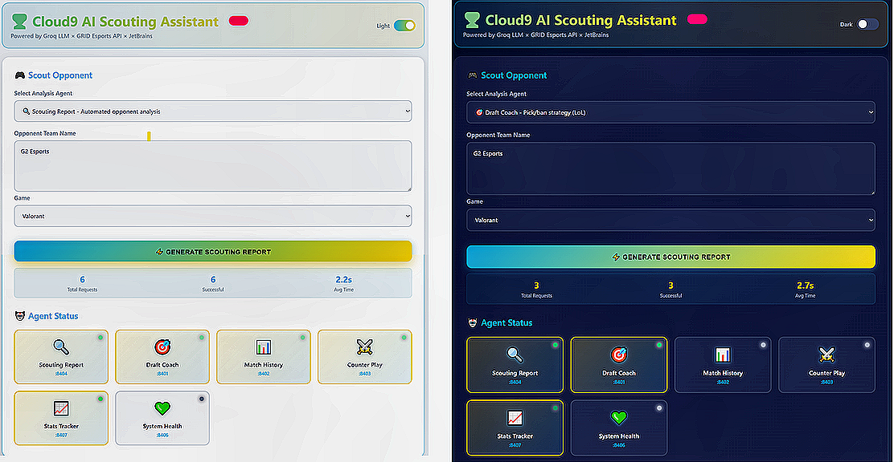

= Cloud9 AI Scouting Assistant
:toc: macro
:toc-placement: manual
:toc-title: Table of Contents
:toclevels: 2
:icons: font
:sectanchors:
:sectlinks:

toc::[]

A **production-ready multi-agent AI scouting system** for professional Valorant and League of Legends teams. Automatically analyzes opponent match history from **GRID Esports API** and generates actionable scouting reports in **seconds instead of hours**.

Built for **Cloud9 x JetBrains Hackathon 2026 — Category 2: Automated Scouting Report Generator**.

Powered by **Groq Llama 3.3 70B**, **GRID GraphQL API**, **FastAPI microservices**, and **n8n orchestration**.

---
image:https://img.shields.io/badge/License-MIT-yellow.svg[MIT]
image:https://img.shields.io/badge/Python-3.12-blue.svg[Python]
image:https://img.shields.io/badge/Docker-required-blue.svg[Docker]
image:https://img.shields.io/badge/FastAPI-framework-green.svg[FastAPI]
image:https://img.shields.io/badge/Groq-LLM-red.svg[Groq]
image:https://img.shields.io/badge/GRID-Esports_API-orange.svg[GRID]
image:https://img.shields.io/badge/n8n-orchestration-orange.svg[n8n]

---

== Why This Matters

Professional esports coaches spend **2–4 hours before every match** manually preparing opponent scouting reports: watching VODs, tracking patterns, analyzing compositions, identifying weaknesses.

**Cloud9 AI Scouting Assistant** automates this entirely — transforming hours of manual work into **near-instant, consistent, high-quality intelligence**.

---

== Category 2 Alignment

[cols="2,3,1",options="header"]
|===
| Requirement | Implementation | Status

| Analyze GRID match data
| GraphQL queries with caching
| ✅

| Generate automated reports
| ScoutingReport aggregation agent
| ✅

| Identify patterns & weaknesses
| MatchHistory, CounterPlay, StatsTracker agents
| ✅

| Support Valorant & League of Legends
| Unified multi-game architecture
| ✅

| Coach-friendly output
| Structured Markdown with actionable insights
| ✅

| Production quality
| Health monitoring, fallback mode, Docker setup
| ✅
|===

---

== System Architecture

**6 specialized AI agents** working in parallel:

[cols="1,1,3",options="header"]
|===
| Agent          | Port | Purpose

| DraftCoach     | 8401 | Draft recommendations, counter-picks
| MatchHistory   | 8402 | Recent form, trends, consistency
| CounterPlay    | 8403 | Exploitable weaknesses, counter-strategies
| ScoutingReport | 8404 | Final aggregated coach-ready report
| StatsTracker   | 8407 | Deep player/team statistics
| SystemHealth   | 8406 | Monitoring, resilience, alerting
|===

**Golden Standard Multi-Agent Design** All agents follow the gold standard of multi-agent systems: clear separation
of responsibilities, transparent reasoning chains, reproducible outputs, and graceful fallback with health
monitoring. This ensures reports are structured, auditable, and coach‑ready.
**Architecture diagrams:**

---

== How It Works

1. **Coach submits request** → team name + game (Valorant/LoL)
2. **n8n triggers parallel agents** → independent analysis
3. **Agents fetch GRID data** → recent matches, stats, compositions
4. **Deep AI reasoning** → Groq Llama 3.3 70B analyzes patterns
5. **ScoutingReport synthesizes** → cohesive, actionable report
6. **Output in seconds** → Markdown + JSON, ready to use

**Example API call:**

[source,bash]
----
curl -X POST http://localhost:8404/mcp \
  -H "Content-Type: application/json" \
  -d '{
    "method": "generate_scout_report",
    "params": {
      "opponent_team": "Sentinels",
      "game": "valorant",
      "recent_matches": 8
    }
  }'
----

**Sample output:**
[source,json]
----
{
  "opponent": "Sentinels",
  "report": "**Key Weaknesses:**\n- Over-reliance on Jett...",
  "recommendations": [
    "Force Haven map (35% def win rate)",
    "Target Jett early with Chamber setups"
  ],
  "reasoning": [
    {"step": 1, "description": "Fetched 8 recent matches"},
    {"step": 2, "description": "Analyzed agent pick rates"},
    {"step": 3, "description": "Generated counter-strategies"}
  ]
}
----

---

== Quick Start

**Prerequisites:** Docker, Docker Compose

[source,bash]
----
# 1. Clone repository
git clone https://github.com/Exsellent/Cloud9-AI-Scouting-Assistant
cd cloud9-ai-scouting

# 2. Configure (optional - demo mode works without keys)
cp .env.example .env

# 3. Start system
docker compose up --build

# 4. Access services
# 🎨 Interactive UI: http://localhost:8001
# n8n Workflows: http://localhost:5680
# API Docs: http://localhost:8401-8407/docs
----

**Demo mode enabled by default** — no API keys required for evaluation!

=== 🎨 Interactive Web UI

The system includes a **production-quality web interface** for easy testing:

**Features:**

* 🎯 **One-click agent selection** — visual agent cards with real-time status
* 🎮 **Game switcher** — toggle between Valorant and League of Legends
* 📊 **Live statistics** — success rate, response times, request count
* 🌓 **Dark/Light themes** — accessible design
* ⚡ **Real-time results** — formatted JSON output with syntax highlighting
* 📈 **Agent health monitoring** — visual status indicators

**Try it:**
[source,bash]
----
# Open browser
open http://localhost:8001

# Enter team name (e.g., "Sentinels")
# Select game and agent
# Click "Generate Scouting Report"
# Results appear in <5 seconds!
----

---

== GRID & Groq Integration

**GRID Esports API:**
- Official match history data
- GraphQL queries for Valorant & LoL
- Player stats, compositions, economy

**Groq Llama 3.3 70B:**
- Sub-second inference
- Deep multi-turn reasoning
- Pattern recognition

**Two operating modes:**
- **Production:** Real GRID API calls
- **Demo/Judging:** Realistic mock data (`DEMO_MODE=true`)

Both modes produce identical report structure.

---

== Why This Wins

✅ **Real GRID Esports data** — not synthetic placeholders

✅ **True multi-agent architecture** — separation of concerns

✅ **Sub-second generation** — Groq ultra-fast inference

✅ **Coach-oriented output** — actionable, not raw stats

✅ **Perfect reproducibility** — one command for judges

✅ **Dual-game support** — Valorant + League of Legends

✅ **Production-ready** — health monitoring, fallbacks, metrics

✅ **Transparent reasoning** — every conclusion explained

---

== Technical Highlights

**Multi-Agent Coordination:**
- MCP protocol for structured communication
- Parallel execution via n8n
- Reasoning chains in every response

**Reliability:**
- SystemHealth agent monitors all services
- Circuit breakers on failures
- Graceful degradation to demo mode

**Observability:**
- Prometheus metrics
- Structured logging
- Health check endpoints

---

== Documentation

Complete technical docs included in **Judge's Pack** (see Additional Info):

- Full API specifications
- MCP protocol details
- n8n workflow export
- Diagram sources (PlantUML)
- Setup & troubleshooting guide

**Quick links:**
- Agent interactions: `docs/TEAMPLAY_INTERACTIONS.md`
- Swagger UI: `/docs` on each agent port

---

== Future Roadmap

- Real-time draft-phase recommendations
- VOD timestamp linking
- Discord bot integration
- Player-vs-player matchup modeling
- CS2, Overwatch support

---

== License

MIT License — See `LICENSE` file

---

== Author

**Tatiana Hlazkina** — AI Engineer & Full-Stack Developer

* Email: mailto:tatiana.adlock@gmail.com[]
* GitHub: https://github.com/Exsellent[]

---

[.text-center]
Built with ❤️ for **Cloud9 x JetBrains Hackathon 2026** 🏆

[.text-center]
_Empowering coaches with AI-powered intelligence_